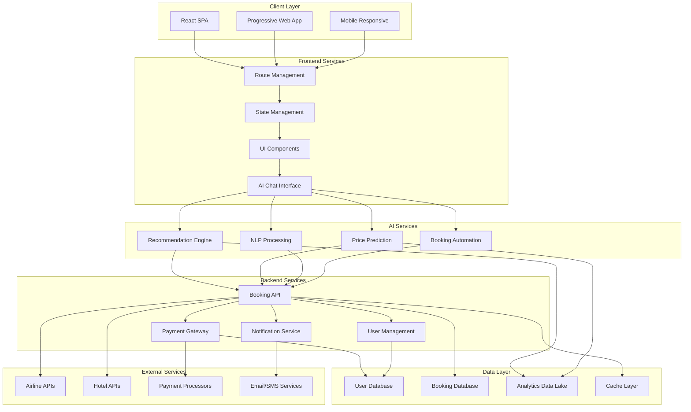
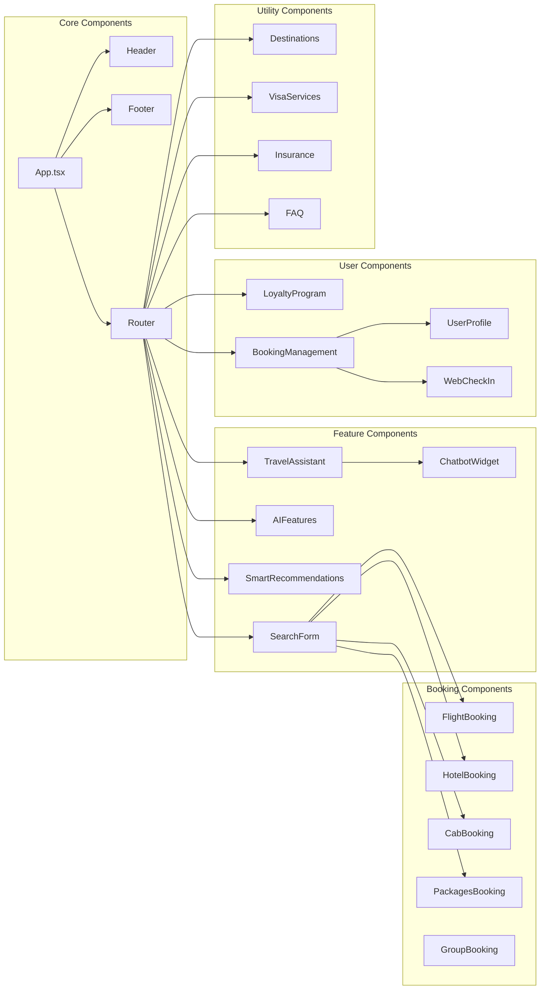
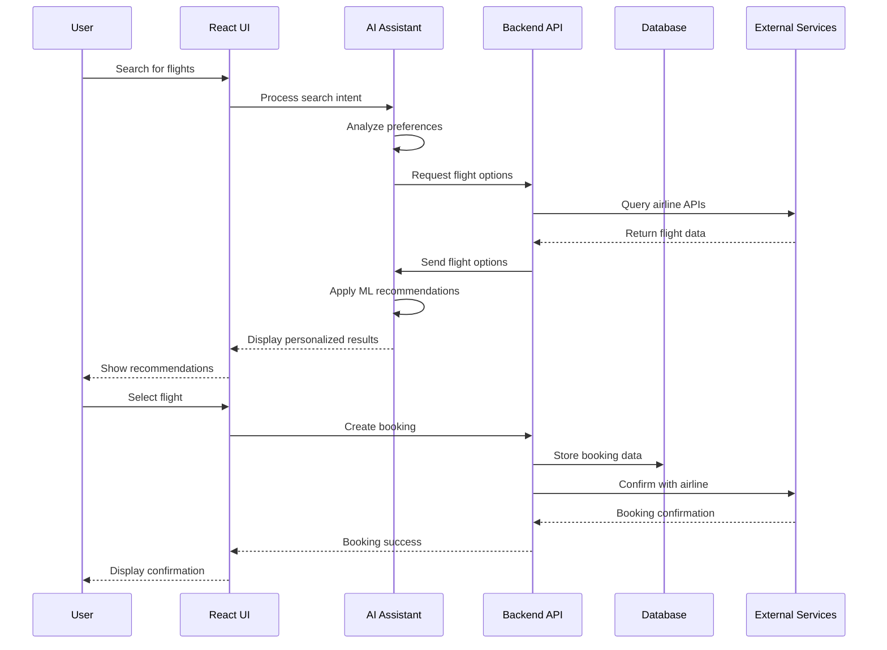
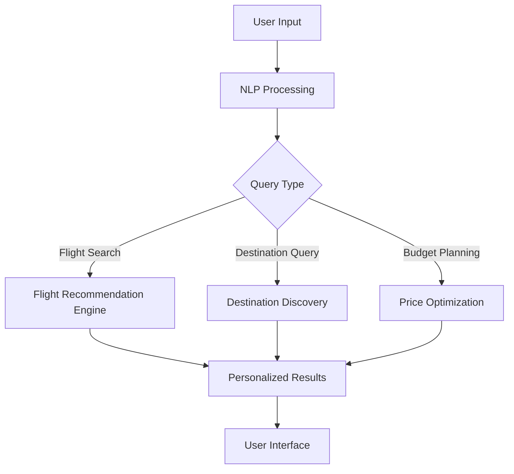
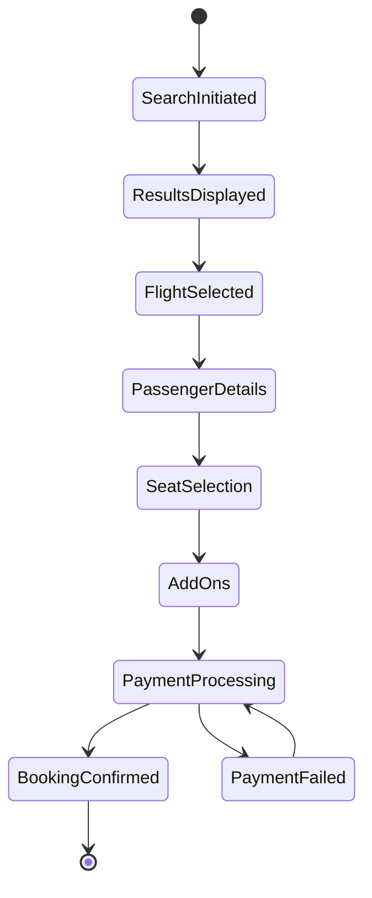
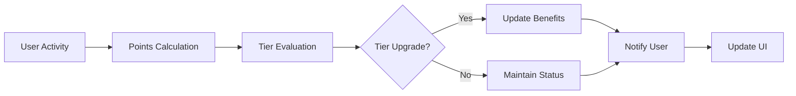
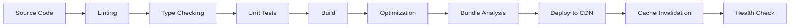

# 🛫 IndiGo AI Travel Platform

<div align="center">
  
  
  
  
  
</div>

<div align="center">
  <h3>🚀 Next-Generation AI-Powered Travel Booking Platform</h3>
  <p>Experience seamless travel planning with intelligent recommendations, predictive analytics, and personalized assistance</p>
</div>

---

## 📋 Table of Contents

- [Overview](#-overview)
- [Key Features](#-key-features)
- [System Architecture](#-system-architecture)
- [Tech Stack](#-tech-stack)
- [Getting Started](#-getting-started)
- [Project Structure](#-project-structure)
- [Feature Modules](#-feature-modules)
- [API Integration](#-api-integration)
- [Development Guidelines](#-development-guidelines)
- [Testing](#-testing)
- [Deployment](#-deployment)
- [Contributing](#-contributing)
- [License](#-license)

## 🌟 Overview

IndiGo AI Travel Platform is a cutting-edge travel booking system that leverages artificial intelligence to revolutionize the travel planning experience. Built with modern web technologies, it offers comprehensive booking services enhanced by intelligent features for personalized recommendations and proactive assistance.

### 🎯 Mission Statement

To simplify travel planning through AI-driven insights while providing a seamless, intuitive booking experience that anticipates and exceeds customer expectations.

## 🚀 Key Features

### 🤖 AI-Powered Capabilities

- **Smart Recommendations**: ML-driven destination and service suggestions
- **Predictive Analytics**: Price forecasting and optimal booking time predictions
- **Natural Language Processing**: Conversational travel assistant
- **Autonomous Booking**: Automated rebooking and upgrade management
- **Real-time Optimization**: Dynamic itinerary adjustments

### ✈️ Core Booking Services

- **Multi-Service Platform**: Flights, hotels, cabs, and vacation packages
- **Group Bookings**: Special rates and management for 10+ travelers
- **Dynamic Pricing**: Real-time fare updates and comparison
- **Seat Selection**: Interactive seat maps with premium options
- **Baggage Management**: Easy addition of extra baggage allowance

### 🏆 Loyalty & Rewards

- **BluChip Program**: Comprehensive loyalty rewards system
- **Tier Benefits**: Multiple membership levels with exclusive perks
- **Points Management**: Earn and redeem across all services
- **Partner Network**: Extended benefits with partner services

### 📱 User Experience

- **Responsive Design**: Seamless experience across all devices
- **Real-time Updates**: Live flight status and notifications
- **Web Check-in**: Complete online check-in process
- **Multi-language Support**: Localized content and UI
- **Accessibility**: WCAG 2.1 AA compliance

## 🏗️ System Architecture

### High-Level Architecture



### Component Architecture



### Data Flow Architecture



## 🛠️ Tech Stack

### Frontend Technologies

| Technology | Version | Purpose |
|------------|---------|---------|
| React | 18.2.0 | UI Library |
| TypeScript | 5.0+ | Type Safety |
| Vite | 4.4+ | Build Tool |
| Tailwind CSS | 3.3+ | Styling Framework |
| Lucide React | Latest | Icon Library |
| React Router | 6.0+ | Navigation |

### Development Tools

| Tool | Purpose |
|------|---------|
| ESLint | Code Linting |
| Prettier | Code Formatting |
| Husky | Git Hooks |
| Jest | Unit Testing |
| Cypress | E2E Testing |

### Design System

- **Colors**: IndiGo Blue (#001B94) & Orange (#FF7F00)
- **Typography**: Inter font family
- **Spacing**: 4px base unit system
- **Components**: Atomic design methodology

## 🚀 Getting Started

### Prerequisites

- Node.js 18.0 or higher
- npm 9.0 or higher (or yarn)
- Git

### Installation

1. **Clone the repository**
   ```bash
   git clone https://github.com/indigo/travel-platform.git
   cd travel-platform
   ```

2. **Install dependencies**
   ```bash
   npm install
   # or
   yarn install
   ```

3. **Set up environment variables**
   ```bash
   cp .env.example .env.local
   ```

4. **Start development server**
   ```bash
   npm run dev
   # or
   yarn dev
   ```

5. **Open in browser**
   ```
   http://localhost:5173
   ```

### Build for Production

```bash
npm run build
# or
yarn build
```

### Preview Production Build

```bash
npm run preview
# or
yarn preview
```

## 📁 Project Structure

```
indigo-travel-platform/
├── public/                 # Static assets
│   └── vite.svg           # App icon
├── src/
│   ├── components/        # Reusable UI components
│   │   ├── booking/       # Booking-related components
│   │   │   ├── FlightBooking.tsx
│   │   │   ├── HotelBooking.tsx
│   │   │   ├── CabBooking.tsx
│   │   │   └── ...
│   │   ├── destinations/  # Destination components
│   │   ├── loyalty/       # Loyalty program components
│   │   ├── AIFeatures.tsx
│   │   ├── ChatbotWidget.tsx
│   │   ├── Header.tsx
│   │   ├── Footer.tsx
│   │   └── ...
│   ├── data/              # Mock data and constants
│   ├── pages/             # Page components
│   │   ├── FlightsPage.tsx
│   │   ├── HotelsPage.tsx
│   │   ├── LoyaltyProgramPage.tsx
│   │   └── ...
│   ├── types/             # TypeScript type definitions
│   ├── utils/             # Utility functions
│   ├── App.tsx            # Main app component
│   ├── main.tsx           # App entry point
│   └── index.css          # Global styles
├── .eslintrc.cjs          # ESLint configuration
├── .gitignore             # Git ignore rules
├── index.html             # HTML template
├── package.json           # Dependencies and scripts
├── tailwind.config.js     # Tailwind configuration
├── tsconfig.json          # TypeScript configuration
└── vite.config.ts         # Vite configuration
```

## 🎨 Feature Modules

### 1. AI-Powered Search Module



### 2. Booking Management System



### 3. Loyalty Program Integration



## 🔌 API Integration

### RESTful API Endpoints

| Endpoint | Method | Description |
|----------|--------|-------------|
| `/api/flights/search` | POST | Search available flights |
| `/api/flights/book` | POST | Create flight booking |
| `/api/hotels/search` | POST | Search hotels |
| `/api/bookings/{id}` | GET | Retrieve booking details |
| `/api/user/profile` | GET | Get user profile |
| `/api/loyalty/points` | GET | Get loyalty points |

### WebSocket Connections

- Real-time flight status updates
- Live chat support
- Price change notifications

## 🧪 Testing

### Unit Testing

```bash
npm run test:unit
```

### Integration Testing

```bash
npm run test:integration
```

### E2E Testing

```bash
npm run test:e2e
```

### Coverage Report

```bash
npm run test:coverage
```

## 🚀 Deployment

### Production Build Process



### Environment Configuration

| Environment | URL | Purpose |
|-------------|-----|---------|
| Development | http://localhost:5173 | Local development |
| Staging | https://staging.indigo.com | Pre-production testing |
| Production | https://www.goindigo.in | Live environment |

## 🤝 Contributing

We welcome contributions! Please see our [Contributing Guidelines](CONTRIBUTING.md) for details.

### Development Workflow

1. Fork the repository
2. Create feature branch (`git checkout -b feature/AmazingFeature`)
3. Commit changes (`git commit -m 'Add AmazingFeature'`)
4. Push to branch (`git push origin feature/AmazingFeature`)
5. Open Pull Request

### Code Standards

- Follow ESLint rules
- Write meaningful commit messages
- Add tests for new features
- Update documentation

## 📄 License

This project is licensed under the MIT License - see the [LICENSE](LICENSE) file for details.

## 📞 Contact

- **Project Lead**: Yash Kavaiya
- **Email**: yash.kavaiya3@gmail.com
- **Phone**: +91 9265745362
- **Location**: Pune, Hinjawadi Phase 1, 410057

---

<div align="center">
  <p>Built with ❤️ by the IndiGo Development Team</p>
  <p>© 2025 IndiGo Airlines. All rights reserved.</p>
</div>
